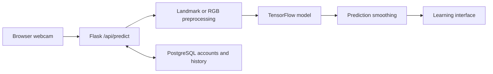

# SignAI | Sign Alphabet Recognition & Learning

A computer-vision web prototype that connects browser webcam capture to sign-alphabet predictions and learning pages. It brings TensorFlow inference, MediaPipe hand landmarks, and PostgreSQL-backed accounts/history into one Flask application.

**Focus:** Computer Vision · Deep Learning · Web Integration · Data Persistence  
**Scope:** 26 Latin-letter classes (A–Z). Alphabet recognition; continuous sign-language translation has not been validated.

[Architecture](#architecture) · [Results](#results--validation) · [Run locally](#how-to-run--known-limitations) · [Limitations](#known-limitations)

## Features

- Browser-camera frames submitted to the prediction API.
- Inference engine supporting 63-feature hand-landmark vectors and RGB CNN inputs.
- Temporal prediction smoothing for more stable displayed letters.
- Learning pages, authentication, and prediction history with PostgreSQL.
- Training scripts and experiment metadata for landmark and image-based models.

## Tech stack

| Layer | Technology |
| --- | --- |
| Web application | Python 3.11, Flask, HTML/CSS/JavaScript |
| Vision & inference | TensorFlow/Keras, MediaPipe, OpenCV, NumPy |
| Persistence | PostgreSQL, psycopg2 |
| Packaging | Docker, Gunicorn |

## Architecture



[app.py](app.py) coordinates routes and authentication; [cnn_model.py](cnn_model.py) loads weights and runs inference; [config.py](config.py) manages configuration; [db_manager.py](db_manager.py) handles PostgreSQL. The engine detects model input shape and falls back to **demo mode** if loading fails. Check model status before interpreting displayed predictions as trained-model output.

## Screenshots

Camera and learning-page captures are not yet included. The following slots are ready for authentic screenshots:

| Planned image | What it should show |
| --- | --- |
| `docs/screenshots/signai-camera.png` | Camera view, predicted letter, and real-model/demo status |
| `docs/screenshots/signai-learning.png` | An existing alphabet learning page |

<!-- Add images here only after capturing the real application and committing the files.


-->

## Results & validation

**Recorded runtime verification — 2026-09-14:** five offline tests passed. The active H5 weights loaded as a landmark DNN with 63 input features and 26 outputs; a zero-input tensor produced finite values. This establishes loading/inference compatibility, not recognition accuracy. These are existing repository records, not a new run for this documentation update.

| Experiment metadata | Recorded metric |
| --- | --- |
| [Landmark DNN](models/landmark_model_meta.json) | Validation accuracy: 99.66% |
| [MobileNetV2](models/mobilenet_model_meta.json) | Validation accuracy: 99.9% |
| [Custom CNN](models/custom_cnn_meta.json) | Test accuracy: 5.15% |
| [Active model](models/model_meta.json) | Accuracy: not recorded (`null`) |

These are separate experiments and splits, not a controlled comparison or reproduced benchmarks. The best experiment score cannot be assigned to the active weights without matching model provenance, data split, and preprocessing.


## Contribution & attribution

The implementation described above is visible in the repository. A personal contribution breakdown is not documented; individual roles are therefore left unspecified. Existing attribution and licensing notes are preserved below.

## How to run & known limitations

Expand the original documentation below for the complete setup commands, limitations, provenance notes, and recorded verification. Its content has been preserved; the presentation update above does not introduce new runtime or benchmark claims.

<details>
<summary>Setup, limitations, and existing technical documentation</summary>

## SignAI — Sign Alphabet Recognition and Learning

A Flask application combining browser webcam capture, sign-alphabet inference, PostgreSQL accounts/history, and learning pages. Model classes cover 26 Latin letters. This is an alphabet-recognition prototype, not a validated continuous sign-language translator.

## How it works

Browser frame → `/api/predict` → preprocessing → TensorFlow model → smoothed prediction → learning interface/history.

The engine supports 63-feature MediaPipe landmark vectors and RGB CNN inputs. It detects model input shape and falls back to demo mode when loading fails. Check model status rather than assuming displayed predictions came from trained weights.

## Source map

| Path | Responsibility |
| --- | --- |
| `app.py` | Routes, authentication, camera/API coordination |
| `cnn_model.py` | Model loading, inference, temporal smoothing |
| `preprocess.py` | Image utilities |
| `config.py` | Environment-based configuration |
| `db_manager.py` | PostgreSQL access and startup schema creation |
| `templates/`, `static/` | Pages, styles, browser logic |
| `models/` | Weights and experiment metadata |
| `training/` | Training scripts/notebook |
| `Dockerfile` | Python 3.11 container entry point |

## Local development

Use Python 3.11, matching the Dockerfile. PostgreSQL is required for working accounts and persistence.

```bash
git clone https://github.com/iimaha-AI/signai13.git
cd signai13
python -m venv .venv
```

Activate with `source .venv/bin/activate` or `.venv\Scripts\Activate.ps1`, then install `python -m pip install -r requirements.txt`.

Copy `.env.example` to `.env` (`Copy-Item .env.example .env` in PowerShell or `cp .env.example .env` in bash). Set your own `DATABASE_URL` and unique `SECRET_KEY`. The local `.env` is now untracked; configuration loads it relative to `config.py` and preserves shell variables. The example defaults to local HTTP development on port 5000. Set `FLASK_ENV=production`, `PORT=7860`, and `SESSION_COOKIE_SECURE=true` for HTTPS hosting.

```bash
python app.py
```

Use the configured `PORT` (code default: 5000). Database initialization happens on import: select a development database. Camera permission is required. Cloud inference uses browser uploads; server-camera endpoints require physical camera hardware.

## Container

```bash
docker build -t signai .
docker run --rm -p 7860:7860 --env-file .env signai
```

Use a container-specific environment with `FLASK_ENV=production`, a stable secret, and reachable PostgreSQL. For localhost HTTP, configure local cookie settings; use HTTPS/secure cookies for hosting. See [existing deployment guide](README_DEPLOY.md); its provider pricing/account instructions were not verified in this review.

## Model evidence

Values below are recorded metadata, not independently reproduced benchmarks:

| Metadata file | Recorded result |
| --- | --- |
| `landmark_model_meta.json` | Validation accuracy 99.66% |
| `mobilenet_model_meta.json` | Validation accuracy 99.9% |
| `custom_cnn_meta.json` | Test accuracy 5.15% |
| `model_meta.json` | Active-model accuracy is null |

Do not assign the best experiment score to active weights without matching hashes, data split, and preprocessing. Add signer-independent testing, confusion matrices, latency, and live-camera evaluation. Static images do not establish motion-dependent sign recognition.

## Training and limitations

`training/train_real_landmarks.py` expects an ASL image dataset under `dataset/asl_alphabet_train/`. It writes model/metadata files used by the app; train in a separate experimental copy. Raw training data is absent.

The Docker command uses one worker to keep the existing in-memory prediction state within one process. Some fallback leaderboard entries are generated demo data. Live-camera, PostgreSQL integration and deployment testing remain outstanding; the actual TensorFlow weights passed the offline runtime test below. See [review notes](docs/REVIEW.md).

## Attribution

Document dataset terms, contributor roles, model provenance, and the intended code license. No license is inferred from hosting instructions.

## Known configuration mismatches

`database/schema.sql` is a legacy MySQL reference; PostgreSQL initialization is implemented in `db_manager.py`. The admin training route returns HTTP 503 when `fast_train.py` is missing, instead of falsely reporting that training started. Restore the original script and status-file contract before enabling that route; the offline scripts are not interchangeable replacements.

## Runtime repair — 2026-09-14

Run `python -m unittest -v test_runtime` from the repository directory. Five offline tests passed in Python 3.11.9 with TensorFlow 2.15.0, NumPy 1.26.4, MediaPipe 0.10.9 and OpenCV 4.11.0. The tests isolate database configuration, exercise public pages/auth redirects, the missing-training-script response, prediction smoothing and real model loading/inference. The active H5 file loaded as a 63-feature landmark DNN with 26 outputs; a zero-input tensor produced finite outputs. This verifies tensor compatibility, not sign-recognition accuracy.

Model paths now resolve relative to the source, shell configuration takes precedence over `.env`, and legacy DB credentials are URL-escaped. Missing DATABASE_URL no longer aborts module import before the existing no-persistence branch can run. Accounts and persistence still require PostgreSQL. The original missing training script is not replaced with an unrelated training algorithm.

MediaPipe requires `opencv-contrib-python`; requirements now select a single cv2 distribution. Start with a fresh virtual environment when upgrading from the old mixed OpenCV installation, as recommended by the [OpenCV package documentation](https://pypi.org/project/opencv-contrib-python/4.11.0.86/). Model files and recognition/training logic were not changed. Docker was inspected but not built in this Windows test environment. PostgreSQL login/history operations, real camera capture and training on the absent ASL dataset have not been verified.

</details>
